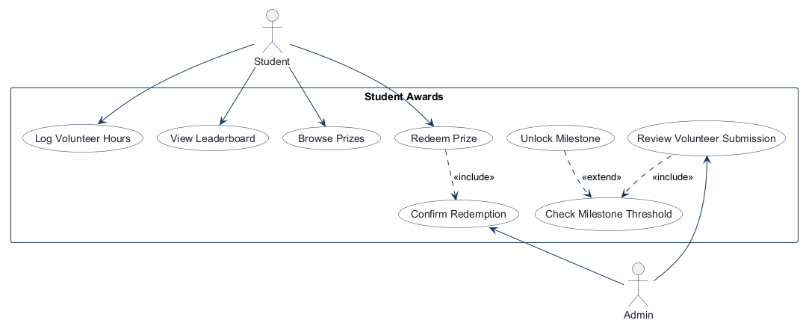
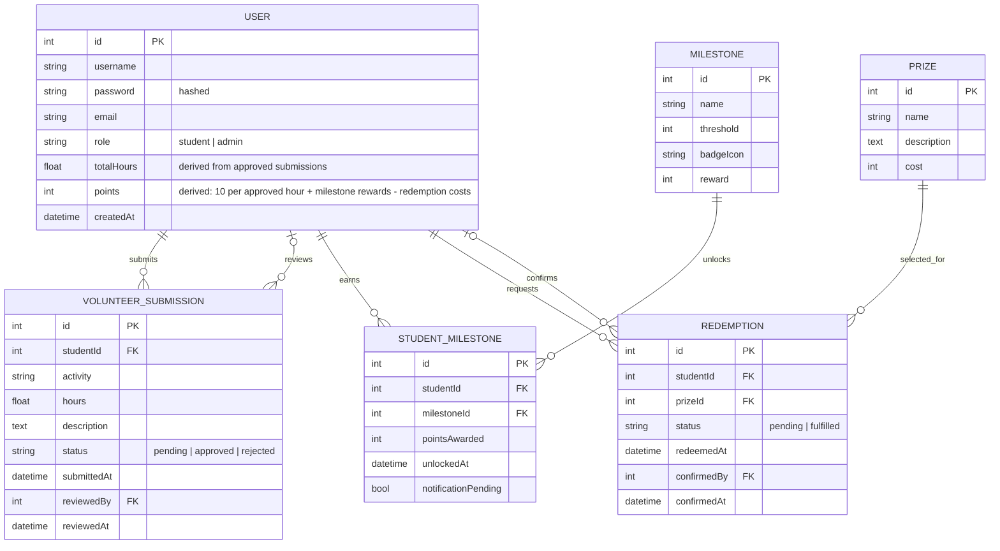
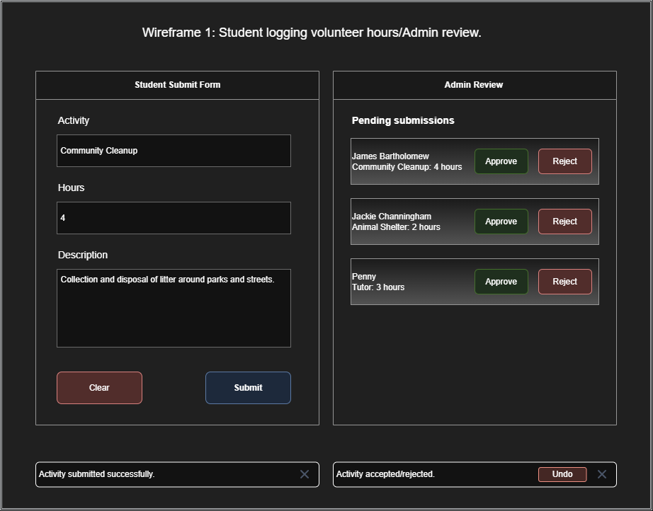
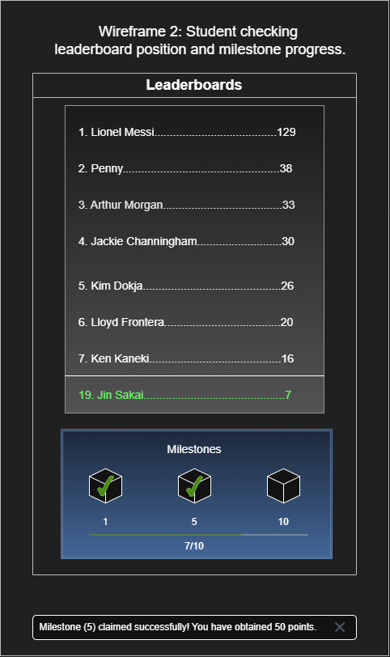
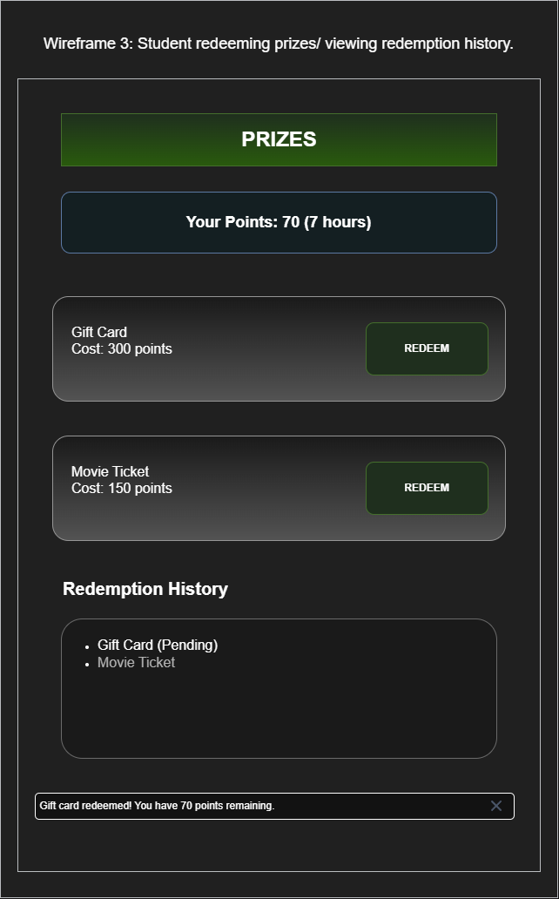

# COMP 3613 Assignment 1

Draft this file with the Guide. **Update it after every phase milestone** before you pause. The use-case diagram is a UML PNG at `docs/diagrams/use-case.png`, linked from this file as `diagrams/use-case.png` (path relative to `docs/report.md`). The model diagram is Mermaid. **Embed wireframe images** as `wireframes/<file>` (files live in `docs/wireframes/`).

Do not put your student ID in this file if you will commit it. The PDF cover adds your name and ID at export time.

## Assigned project
Student Awards (incentive system)

## Three workflows

### 1. Log Volunteer Hours (Student + Admin)
The student submits a volunteer activity and hours worked. An admin reviews the submission and approves or rejects it.

**Done:** Approved hours appear in the student's total and the leaderboard is updated.

### 2. View Leaderboard & Unlock Milestones (Student)
The student opens the leaderboard page and sees all students ranked by approved hours. When the student's total crosses a milestone threshold, the milestone unlocks.

**Done:** The milestone badge is visible on the student's profile and the leaderboard reflects current standings.

### 3. Redeem Points for Prize (Student + Admin)
The student browses available prizes they can afford and selects one. The system deducts points and creates a redemption request. An admin confirms the redemption as fulfilled.

**Done:** Points are deducted, the prize is marked claimed, and redemption history is visible to both the student and admin.

## Use case diagram

Phase 2 notes: Student and Admin are the actors. Review Volunteer Submission includes Check Milestone Threshold, and Unlock Milestone extends that check only when the threshold is crossed. Redeem Prize includes Confirm Redemption. The approval result remains part of Log Volunteer Hours.

## Model diagram

Phase 3 first draft. `StudentMilestone` records which milestones each student has unlocked; a student can unlock each milestone at most once.

Relationship and business-rule notes: each volunteer submission belongs to one student and may be reviewed by one admin; each redemption belongs to one student and one prize and may be confirmed by one admin. `reviewedBy` / `reviewedAt` and `confirmedBy` / `confirmedAt` are assumed unset while their records are pending. `StudentMilestone` should enforce uniqueness on `(studentId, milestoneId)`. Approved submissions contribute to `User.totalHours`; redemptions spend points. Prizes have no stock limit, per the revised wireframe.

## Wireframes

### Log Volunteer Hours

### View Leaderboard & Unlock Milestones

### Redeem Points for Prize

`python manage.py report` also embeds any PNG/JPG still missing from `docs/wireframes/`.

## Theming

Dark Student Awards theme: black and charcoal surfaces with white text, green success/approve/submit actions, red reject/cancel/undo actions, and a clean sans-serif typeface. Applied to the landing, login, and register pages; shared brand tokens and the authenticated shell use the same palette. The wordmark is plain text: Student Awards.

## Implementation notes

One named workflow at a time. Include verify notes and polish / model revisions (Phase 5). Do not treat the first build as final.

Phase 5, theming and workflow 1 implementation: applied the requested palette and sans-serif type to public/auth pages and the authenticated shell. The wireframe's Activity field was added to `VolunteerSubmission`; the student completed the SQLModel field and thin route snippets. Volunteer submission, admin approve/reject, approved-hour totals, undo actions, My Activities history, digit-only hours, live queue removal, bottom toasts, and landing/sign-out navigation are implemented. My Activities has All/Pending/Accepted/Removed filters; its default unfiltered list groups pending first, then remaining statuses by recency. Approved hours are aggregated from approved submissions rather than stored redundantly on User. Follow-up polish repaired shared shell markup, made toast visibility independent of Bootstrap's toast plugin, guarded optional toast controls so missing Undo markup cannot abort form/review handlers, added a dedicated toast-visible state above the viewport bottom, and reconnected `/app` and `/admin` to the activity screen with review/history endpoints. Student verification of these fixes is pending.

Phase 5, workflow 2: milestones are seeded at 1, 5, 10, then every 10 through 100 hours, awarding 10 points per threshold. Admin approval persists each newly reached unlock; its notification is shown to the student on the next leaderboard visit. The leaderboard ranks by approved hours, shows the top seven and the signed-in student's rank, and displays milestone badges/progress. The milestone carousel initially shows the next target with the two latest unlocks (or the first three when fewer than two are unlocked); it fills the panel with three evenly spaced items, slides the tiles as a single track via arrows and mouse-drag/touch-swipe, and reveals an icon return control beneath it after moving away from the starting window. Approved hours and points are derived; milestone reward amounts and notification state are persisted on `StudentMilestone`. Student verified: submitted hours, admin approval, next-visit milestone toast, and updated total all worked.

Phase 5, workflow 3: the no-stock prize catalog includes Coffee Voucher (50), $10 Amazon Gift Card (200), Campus Water Bottle (400), Movie Ticket (600), Campus Hoodie (1,000), and Laptop (5,000). All prizes remain visible; Redeem is disabled when the student's available points are insufficient. Redemption immediately deducts its cost and appears in student/admin history. Admins manage each request through Pending, Processing, Shipping, and Delivered statuses; students see the current status in their history. Status badges are red, orange, yellow, and green respectively; the admin sees a color-only badge beside the selected dropdown value. Delivered records store the confirming admin and timestamp. Points are derived from approved hours and milestone rewards less redemption costs.

<!-- student-build:code-check
workflow: Log Volunteer Hours
check: SQLModel snippet in app/models/volunteer_submission.py
passed: yes
architecture_ok: yes
note: Student added the Activity field alongside the submission fields.
-->
<!-- student-build:code-check
workflow: Log Volunteer Hours
check: thin route snippet in app/routers/volunteer_hours.py
passed: yes
architecture_ok: yes
note: Route constructs the service/repository and delegates submission creation without persistence logic.
-->
<!-- student-build:code-check
workflow: View Leaderboard & Unlock Milestones
check: SQLModel snippet in app/models/milestone.py
passed: yes
architecture_ok: yes
note: Student added the integer reward field for each milestone.
-->
<!-- student-build:code-check
workflow: View Leaderboard & Unlock Milestones
check: thin route snippet in app/routers/leaderboard.py
passed: yes
architecture_ok: yes
note: Student route obtains leaderboard data through the service and renders the template.
-->
<!-- student-build:code-check
workflow: Redeem Points for Prize
check: SQLModel snippet in app/models/prize.py
passed: yes
architecture_ok: yes
note: Student added the integer points cost field.
-->
<!-- student-build:code-check
workflow: Redeem Points for Prize
check: thin route snippet in app/routers/prizes.py
passed: yes
architecture_ok: yes
note: Student calls the prize service and returns a JSON result without persistence logic in the route.
-->

## Deployed app

Phase 6. Public Render URL (not localhost). Markers open this to mark the three workflows.

https://

## Logins

Every account a marker needs, including extra users you added. Starter accounts:

- bob / bobpass — regular user
- admin / adminpass — admin

## YouTube URL

## Session transcripts

Filled when the Guide builds the report: the agent writes each Guide chat to `docs/transcripts/<slug>.md` (Copilot Agent, Cursor, or OpenCode). `python manage.py report` packages them. Do not paste chats here during the build.

## Competency (student-judge)

Filled when the report is built. Guide runs student-judge, writes `docs/judge.md`, and export appends the scorecard here.

## Skill integrity

Filled by `python manage.py report`. Do not edit the course skills.
